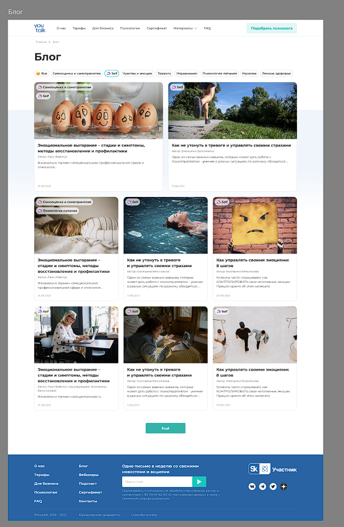
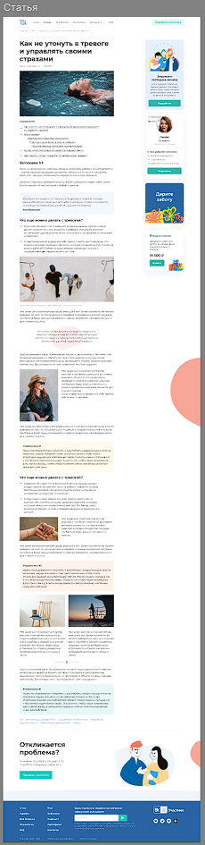

# Домашнее задание. Реальный опыт | Проект: реальный кейс от компании «Youtalk»

## ТЗ





## Критерии оценивания

- соблюдение семантической верстки;
- применение псевдоэлементов или псевдоклассов;
- применение подхода accessibility; 
- использование методологии БЭМ; 
- корректность адаптивной верстки; 
- соблюдение форматов иконок и картинок; 
- соблюдение структуры документа ( вложенность, отступы). 

<b>В проекте вместо БЭМ используются scss модули</b>

## Стэк

- React (TypeScript)
- Scss modules


## Архитектура

Приложение спроектировано по методологии [FSD](https://feature-sliced.github.io/documentation/ru/docs/get-started/overview). 


## Запуск

- Убедиться, что установлен [Node.js](https://nodejs.org/en/download)
- Прописать в терминале из корня проекта:
  ```
  npm i
  npm run dev
  ```
В результате запустится сервер на http://localhost:5173/sf-frontend

## Деплой

Приложение опубликовано с помощью gh-pages и доступно [здесь](https://ggermashev.github.io/sf-frontend)

## Как открыть страницу со статьей?

Кликнуть на любую карточку на главной странице